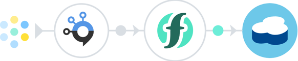

# Triggering IBM Cloud Functions with Message Hub records
Create Message Hub data processing apps with IBM Cloud Functions powered by Apache OpenWhisk. This tutorial should take about 5 minutes to complete. After this, move on to more complex serverless applications such as those tagged [_openwhisk-hands-on-demo_](https://github.com/search?q=topic%3Aopenwhisk-hands-on-demo+org%3AIBM&type=Repositories).



If you're not familiar with the Cloud Functions/OpenWhisk programming model [try the action, trigger, and rule sample first](https://github.com/IBM/openwhisk-action-trigger-rule). [You'll need an IBM Cloud account and the latest OpenWhisk (`wsk`) or IBM Cloud command line plugin (`bx wsk`)](https://github.com/IBM/openwhisk-action-trigger-rule/blob/master/docs/OPENWHISK.md).

This example shows how to create an action that consumes Message Hub (Apache Kafka) messages (records).

1. [Configure Message Hub](#1-configure-message-hub)
2. [Create Cloud Function actions, triggers, and rules](#2-create-cloud-function-actions-triggers-and-rules)
3. [Clean up](#3-clean-up)

# 1. Configure Message Hub
## Provision an IBM Message Hub service instance
Log into the IBM Cloud, provision a [Message Hub](https://console.ng.bluemix.net/catalog/services/message-hub) instance, and name it `openwhisk-kafka`. On the "Manage" tab of the Message Hub console create a topic named "cats-topic". Set the corresponding names as environment variables in a terminal window:

```bash
export KAFKA_INSTANCE="openwhisk-kafka"
export KAFKA_TOPIC="cats-topic"
```

## Import the service credentials into the OpenWhisk environment
We will make use of the built-in [Cloud Functions Kafka package](https://github.com/apache/incubator-openwhisk-package-kafka#producing-messages-to-message-hub), which contains a set of actions and feeds that integrate with both Apache Kafka and IBM Message Hub (based on Kafka).

With Cloud Functions on the IBM Cloud, this package can be automatically configured with the credentials and connection information from the Message Hub instance we provisioned above. We make it available by refreshing our list of packages.

```bash
# Ensures the IBM Message Hub credentials are available to Cloud Functions.
wsk package refresh
```

# 2. Create Cloud Function actions, triggers, and rules
## Attach a trigger to the Message Hub topic
Triggers can be explicitly fired by a user or fired on behalf of a user by an external event source, such as a feed. Use the code below to create a trigger to fire events when messages are received using the "messageHubFeed" provided in the Message Hub package.

```bash
# Create trigger to fire events when messages (records) are received
wsk trigger create message-received-trigger \
  --feed Bluemix_${KAFKA_INSTANCE}_Credentials-1/messageHubFeed \
  --param isJSONData true \
  --param topic "$KAFKA_TOPIC"
```

## Create an action to process messages from the topic
Create a file named `process-message.js`. This file will define an action written as a JavaScript function. This function will print out messages that are received from Kafka. For this example, we are expecting a stream of messages that contain a `cat` object with `name` and `color` fields.

```javascript
function main(params) {

  console.log(params);

  return new Promise(function(resolve, reject) {
    if (!params.messages || !params.messages[0] || !params.messages[0].value) {
      reject("Invalid arguments. Must include 'messages' JSON array with 'value' field");
    }
    var msgs = params.messages;
    var cats = [];
    for (var i = 0; i < msgs.length; i++) {
      var msg = msgs[i];
      for (var j = 0; j < msg.value.cats.length; j++) {
        var cat = msg.value.cats[j];
        console.log('A ' + cat.color + ' cat named ' + cat.name + ' was received.');
        cats.push(cat);
      }
    }
    resolve({
      "cats": cats
    });
  });

}
```

Deploy an IBM Cloud Function from the JavaScript file.
```bash
wsk action create process-message process-message.js
```

## Map the action to the trigger with a rule
We are going to configure this action to be invoked in response to events fired by the `message-received-trigger` when messages are received on the Message Hub topic.

To do this, we create a rule, which maps triggers to actions. Once this rule is created, the `process-message` action will be executed whenever the `message-received-trigger` is fired in response to new messages being written to the Kafka stream.

```bash
wsk rule create log-message-rule message-received-trigger process-message
```

## Enter data to fire a change
Begin streaming the Cloud Functions activation log in a second terminal window.
```bash
wsk activation poll
```

Now send a message to Message Hub using the message producer action back in the original window.
```bash
echo '{"cats": [{"name": "Tahoma", "color": "Tabby"}, {"name": "Tarball", "color": "Black"}] }' > records.json
DATA=$( base64 records.json )

wsk action invoke Bluemix_${KAFKA_INSTANCE}_Credentials-1/messageHubProduce \
  --param topic $KAFKA_TOPIC \
  --param value "$DATA" \
  --param base64DecodeValue true
```

View the log to look for the change notification. You should see activation records for the producing action, the rule, the trigger, and the consuming action.

# 3. Clean up
## Remove the rule, trigger, action, and package

```bash
# Remove rule
wsk rule disable log-message-rule
wsk rule delete log-message-rule

# Remove trigger
wsk trigger delete message-received-trigger

# Remove actions
wsk action delete process-message

# Remove package
wsk package delete Bluemix_${KAFKA_INSTANCE}_Credentials-1
```

# Troubleshooting
Check for errors first in the Cloud Functions activation log. Tail the log on the command line with `wsk activation poll` or drill into details visually with the [Cloud Functions monitoring console](https://console.ng.bluemix.net/openwhisk/dashboard).

If the error is not immediately obvious, make sure you have the [latest version of the `wsk` CLI installed](https://console.ng.bluemix.net/openwhisk/learn/cli). If it's older than a few weeks, download an update.
```bash
wsk property get --cliversion
```

# License
[Apache 2.0](LICENSE.txt)
